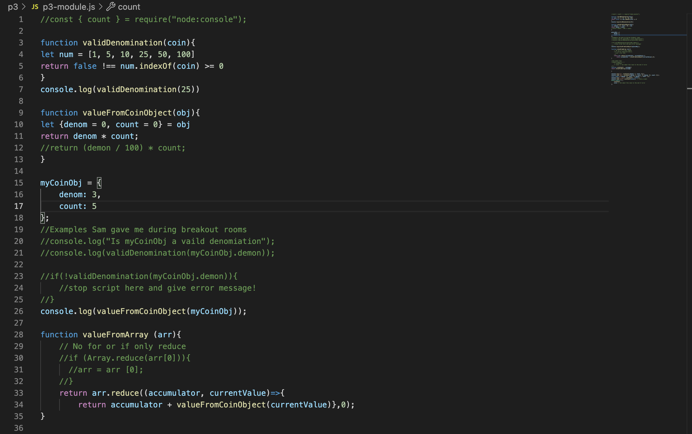

## Welcome to Project 3

This week we continued to work on Git, denom, count, arrays and fasitfy. Importing our code on to the server to open it on local broswers.

After completing this project, you will:

Gain experience interpreting functional descriptions and specifications to complete an assignment

Gain experience breaking a project into manageable components

Gain experience writing and executing non-web server Node.js JavaScript code using VSCode

Practice creating and using code modules

Practice refactoring using modern JavaScript syntax

Gain experience writing and executing web server Node.js JavaScript code using VSCode

Gain experience using Fastify with the GET verb, routes, and query parameters

Gain experience loading a file and using as a web page

